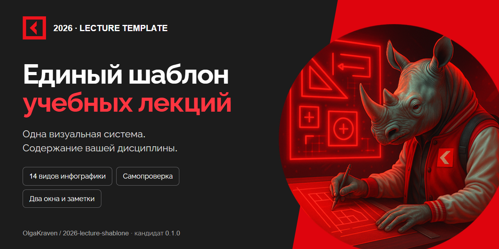

# Единый шаблон лекционных сайтов

Версия **0.2.0**: общий движок, данные курса отдельно, повторное использование компонентов без копирования оформления. Шаблон согласован пользователем 12 сентября 2026 года.



Каталог сохраняет композицию ОКФКС. Порядок верхних иконок взят из УД; скачивание перенесено наверх. Есть PDF по лекции/семестру/году, библиотека инфографики, четыре типа автономной самопроверки и два синхронизированных окна с редактором заметок.

## Возможности 0.2

Инфографика получила адаптивные блоки, крупный просмотр, текстовую мобильную версию и три новых вида: слои, воронка и дорожки ответственности. На экранах до 820px правильные ответы и разборы самопроверки не выводятся; результаты, баллы и повторная попытка также скрыты.

В каталоге появились «Инструменты курса» и «Вход» в редактор: проверка готовности, локальный редактор с историей и предпросмотром, резервные копии, офлайн-загрузка, закладки, глоссарий и карта программы. Поиск охватывает тексты слайдов. В панели преподавателя есть план времени и перерыв, импорт старого сценария с предупреждением. [Инструкция 0.2](docs/FEATURES_02.md) · [История изменений](CHANGELOG.md).

Хендбуки и новый формат раздаточных материалов отложены для отдельного обсуждения. Демонстрационные литература и карта РПД ожидают подтверждённых исходных данных.

## Запуск

Требуется Node.js 22.18+ и npm.

```sh
npm ci
npm run dev
```

Адрес выводится в терминале. Выберите лекцию → иконка «Начать занятие в двух окнах» в верхнем меню. В панели преподавателя можно загрузить JSON со сценарием, редактировать заметки и сохранить их отдельным файлом.

## Новый курс

Данные находятся в `public/course.json`. При генерации передайте название МДК, дисциплину, семестры, год, слоган, тематического носорога и **materialsUrl — ссылку на папку материалов**. Кнопка «Материалы» появится автоматически. Если ссылка пока неизвестна, оставьте пустую строку; её можно добавить в настройках перед занятием.

Не меняйте компоненты для подстановки дисциплины. `src/engine` содержит общие компоненты, `public/course.json` — демонстрационные данные. Новые курсы должны использовать собственные данные и тематическое изображение. Демонстрация содержит 86 слайдов; это набор образцов, а не полный курс по РПД.

## Повторное использование движка

```sh
npm run build:engine
npm pack
```

Установите полученный `.tgz` в React-проект курса и подключите:

```tsx
import { LectureSite, validateCourse } from '@olgakraven/lecture-engine'
import '@olgakraven/lecture-engine/style.css'
validateCourse(course)
return <LectureSite course={course} base={import.meta.env.BASE_URL} />
```

Файлы логотипа, шрифта и тематического маскота размещаются по путям конфигурации. Используйте точную версию пакета. Обновление опубликованного курса требует обновления зависимости и пересборки; изменения не подменяются во время занятия.

## Самопроверка и заметки

Пользователь выбрал автономный учебный режим. `public/assessment.json` содержит технически доступные ключи, а интерфейс раскрывает ответы после попытки. Неверная и верная попытки, дробное оценивание соответствий, повтор и результаты реализованы локально. Сервис не требуется.

Полные сценарии и личные заметки преподавателя находятся отдельно: импортируемый JSON и локальное хранилище браузера. `private/` исключён из Git и сборки. Не размещайте преподавательский файл в `public/`. Audience не загружает банк ответов и не получает заметки по каналу синхронизации.

## Проверки и документы

```sh
npm run validate:content
npm run test:unit
npm run check:readiness
npm run lint
npm run build
npm run check:privacy
```

- [Строгие правила шаблона](docs/TEMPLATE_RULES.md)
- [14 видов инфографики](docs/INFOGRAPHICS.md)
- [Происхождение компонентов](docs/SOURCES.md)
- [Фактическая проверка](docs/QA.md)

Демонстрация: https://olgakraven.github.io/2026-lecture-shablone/ . Изменения main проходят проверки и публикуются GitHub Actions. Превью README и Open Graph подготовлены отдельно; настройка Social preview GitHub требует загрузки изображения в настройки репозитория.


## Инструкция по генерации

[Общая инструкция подготовки лекций](docs/GENERATION_GUIDE.md). Для этого шаблона применяется автономная самопроверка и управляемый преподавателем разбор в окне аудитории; конкретные правила сайта закреплены в TEMPLATE_RULES.md.

## Литература и сценарий

После титула размещаются основная и дополнительная литература, материалы. Подтемы открываются разделителем со стрелкой; последний слайд — вопросы аудитории. Источники заполняются через literature или references; существующие корректные данные сохраняются. См. [полную инструкцию](docs/LECTURE_INSTRUCTION.md) и [правила](docs/TEMPLATE_RULES.md), включая обязательные контекстные заметки к каждому слайду.

## Инструкция пользователя

[Как работать с сайтом и его кнопками](docs/USER_GUIDE.md). На сайте инструкция доступна по ссылке «Как пользоваться сайтом» рядом с переключателем темы в каталоге и в верхнем меню лекции.

Содержание визуальной инструкции: `docs/guide-content.json`. После правок выполните `node scripts/generate-guide.mjs`: страница `public/guide.html` собирается с теми же SVG-иконками Lucide, что используются в интерфейсе.

## Лицензия

Оригинальный код и документация — [MIT](LICENSE). Сторонние зависимости и брендовые материалы сохраняют свои условия; см. [происхождение ресурсов](docs/SOURCES.md).
